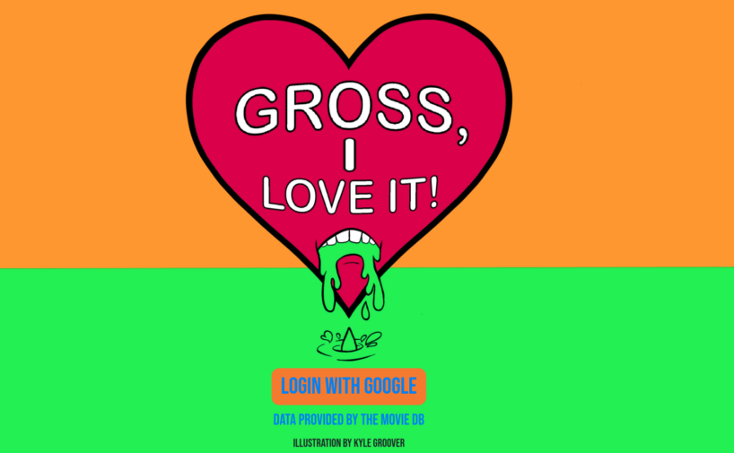
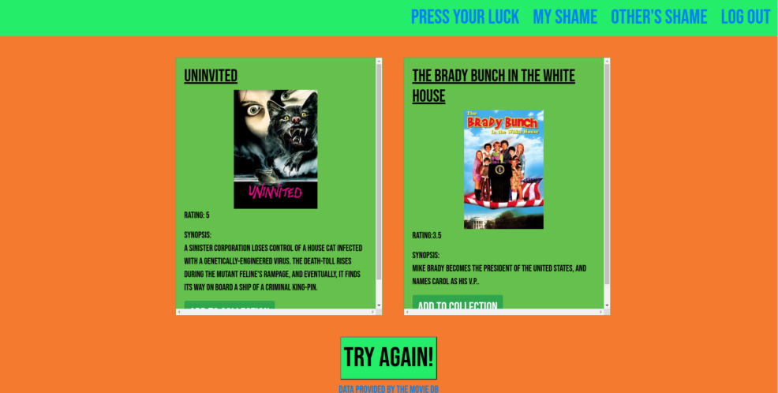
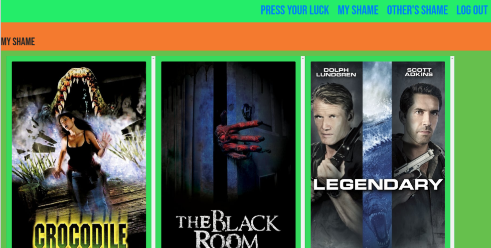
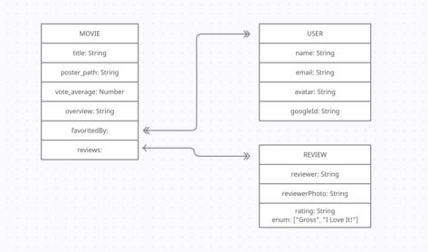

# Gross, I Love It!

[Check it out!](https://gross-i-love-it.herokuapp.com/)

## It's a movie collector! It's a game! It's a trip down the rabbit hole of horrible movies!

Netflix, Amazon, Rotten Tomatoes. They all try to point us in the direction of quality cinema that is worth your hard-earned dollars and time. But what aren't they showing you? Yeah, I ranked that sci-fi B movie "2 Stars", but that dosen't mean I don't want to see movies like that on my feed!
Gross, I Love It! To the rescue!
A fun, movie-collection app that only allows the worst of the worst from the archives over at The MovieDB!

## Goals

1. AAV, I should find myself on a home page, asking me to log in with Google OAuth and I should be able to click a button that redirects me to Google to sign in.
2. AAU, once signed in, I should find myself on the game page and prompted to click and reveal the random titles underneath. 
3. AAU, I should be able to pick one or the other movie and add it to my collection, OR click refresh to try again.
4. AAU, I should be able to see my library of saved movies and the responses left by other users.
5. AAU, I should be able to see an index of users and be able to click on their names to get their movie library view and leave my own responses on their separate titles.

## Wire-Frames

## Screenshots

## Trello Planning

[Trello](https://trello.com/b/In0IadKA/gross-i-love-it)

## Icebox Features

1. AAU, I should be able to select one movie and be offered two new movies that have something in common with the first (i.e. Director, Actors, Writers)
2. AAU, I should be able to add users or delete users to my friend's list to keep easier tabs on movie collections that I would like to follow.
3. AAU, I should be able to click a link under each title that brings me to where I might be able to view that title (i.e. Netflix, Amazon etc.)
   

## Journey

I'm a huge fan of movies and often I find myself defending my critical opinion of a movie with something along the lines of "I'm not saying I didn't love it, I'm just saying that it's terrible." I really loved the idea of a movie querey that decidedly only shows the bottom of the barrel and forces the user into picking a side ( or trying again if the two random titles just don't suit their fancy). 
The idea for this app was inspired mainly from the creators at [Red Letter Media](https://www.redlettermedia.com/) and more specifically their program "Best of the Worst", where they pit three, generally terrible, films against eachother to judge their merits.

## Challenges and Takeaways

This being my first solo foray into API calls, I made things even more difficult for myself right off the bat by deciding that I wanted to not only return a random movie, but that movie would have a score under 55% on The Movie DB (pretty bad and below, ONLY), have more than 20 votes (to weed out user submissions and short videos that literally no one has ever heard of) AND that I would call for a second movie with the same conditions at the same time that would be guaranteed to not be the same as the first title. PHEW. 
Challenging and new, for sure, but a few hours in Postman and the Movie DB docs and I had my movie querey down pat.
The next largest challenge would have to be the styling. I was able to pull on the most valuable resource at all for my homepage art, an amazing partner who also happens to be an incredible illustrator. I wanted the color scheme to refelct the vomit idea, but also bring in the fun of Nickledeon. 

My main takeaways are:
- that API's are wonderful and you can do a lot of fun things with large amounts of data
- I need to spend a week in CSS and Boostrap tutorials so that styling can be the fun icing on top of my projects and not the deflating experience it tends to be.

## Attributions and Special Thanks

-Movie data provided by [The MovieDB](https://www.themoviedb.org/)

-"Vomiting Heart" illustration provided by Kyle Groover
@gem.tooth on Instagram

-Styling tools provided by Bootstrap.

-Massive thanks to my GA SEI cohort instructors, TA's and fellows for all the assists and laughs.

### Technologies Used

HTML, CSS, JS, Node.JS, Express, MongoDB, Mongoose, Method-Override, Axios, Passport, Google OAuth, EJS, Dotenv, GitHub, Heroku, Bootstrap