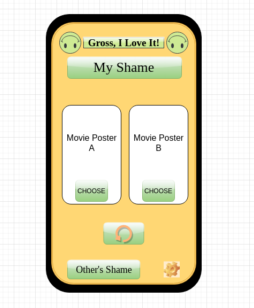
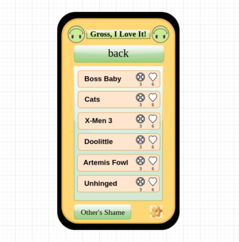
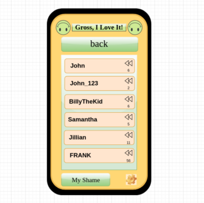

# Gross, I Love It!

[Check it out!](https://gross-i-love-it.herokuapp.com/)

## It's a movie collector! It's a game! It's a trip down the rabbit hole of horrible movies!

Netflix, Amazon, Rotten Tomatoes. They all try to point us in the direction of quality cinema that is worth your hard-earned dollars and time. But what aren't they showing you? Yeah, I ranked that sci-fi B movie "2 Stars", but that dosen't mean I don't want to see movies like that on my feed!
Gross, I Love It! To the rescue!
A fun, movie-collection app that only allows the worst of the worst from the archives over at The MoiveDB!

## Wire-Frames

## Goals

1. AAV, I should find myself on a home page, asking me to log in with Google OAuth and I should be able to click a button that redirects me to Google to sign in.
2. AAU, once signed in, I should find myself on my profile view. Containing my avatar, alias, and collection of movies, as well with emojis from other users pertaining to each title.
3. AAU, I should be able to see an index of users and be able to click on their names to get their full profile view and leave my own emoji's on their separate titles.
4. AAU, I should be able to click a button to bring me to the collector game view with two areas to click and reveal the random titles underneath. 
5. AAU, I should be able to pick one or the other movie and add it to my collection, OR click refresh to try again.

## Attributions and Special Thanks

Movie posters, names, etc by [The MovieDB](https://www.themoviedb.org/)